# TaoQuick-DotNet

TaoQuick for C#/DotNet 5

TaoQuick-DotNet is a transplant library from TaoQuick base on qmlnet.

[TaoQuick](https://github.com/jaredtao/TaoQuick) is a cool Qt/Qml component library with many UI and effect components.

[qmlnet](https://github.com/qmlnet/qmlnet) is Qt/QML integration/support for .NET

# Project Status

Under construction

# Some Demo Preview

## Main Page

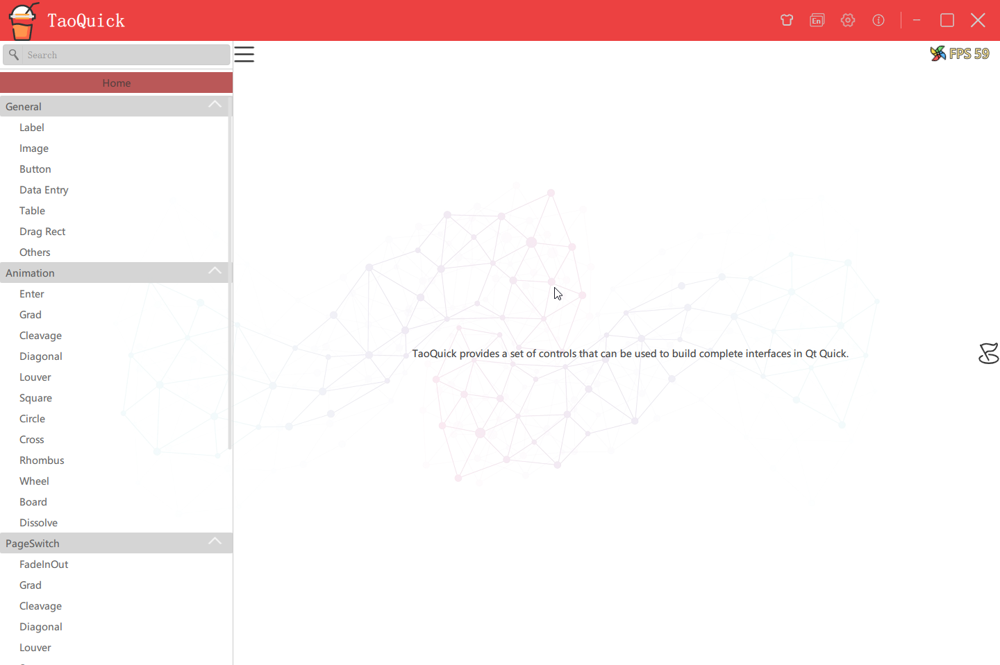

## Change Skin

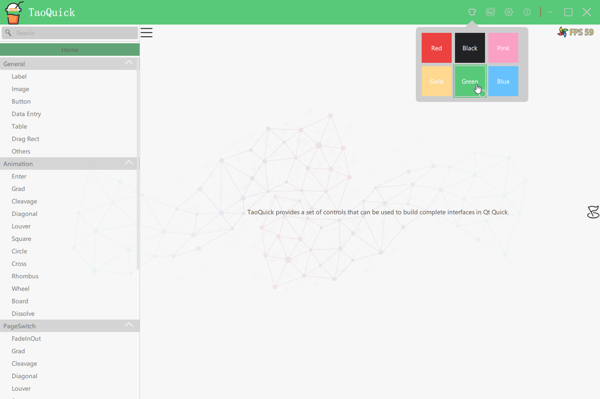

## Multi-Language

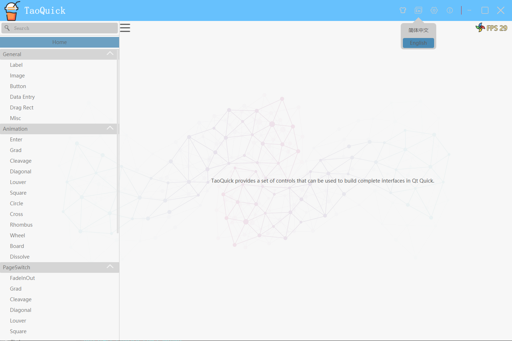

## Some Button Controls

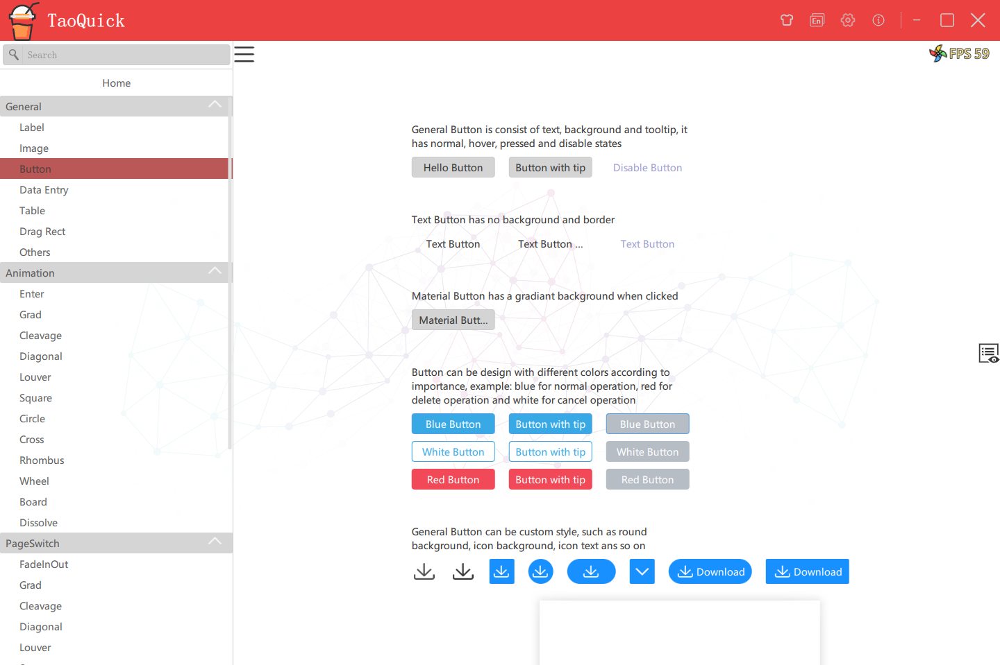

## Data entry Controls

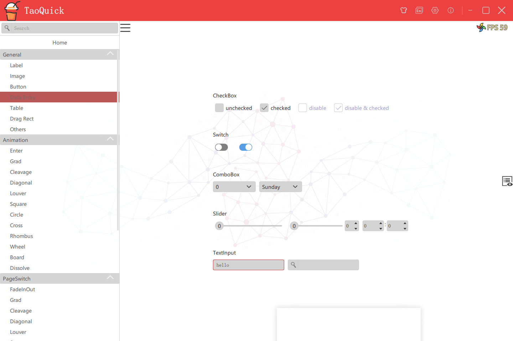

## Table Controls

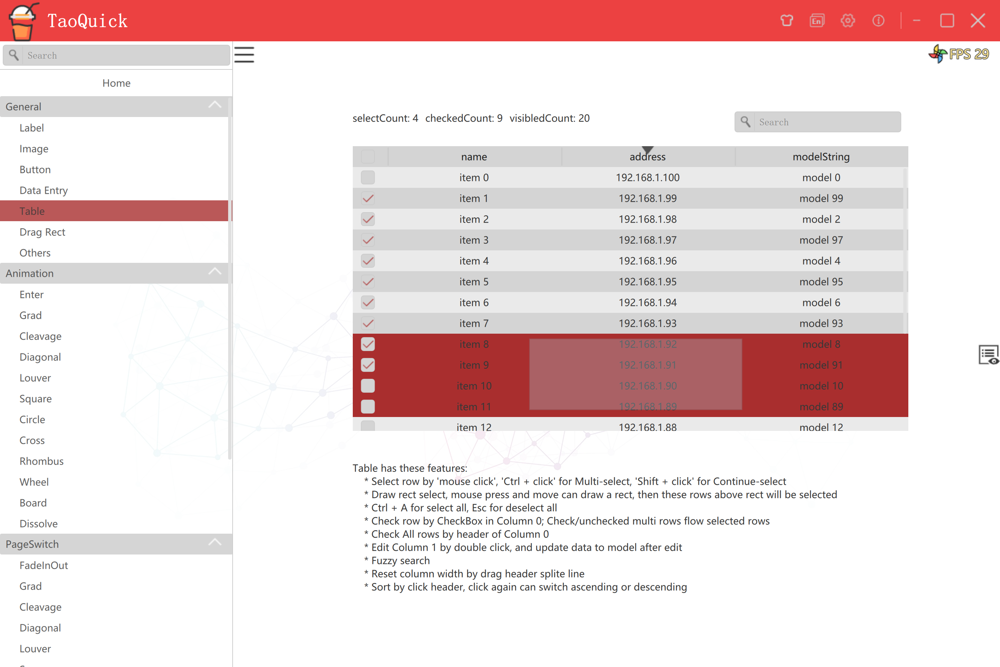

## Rect Drag Controls

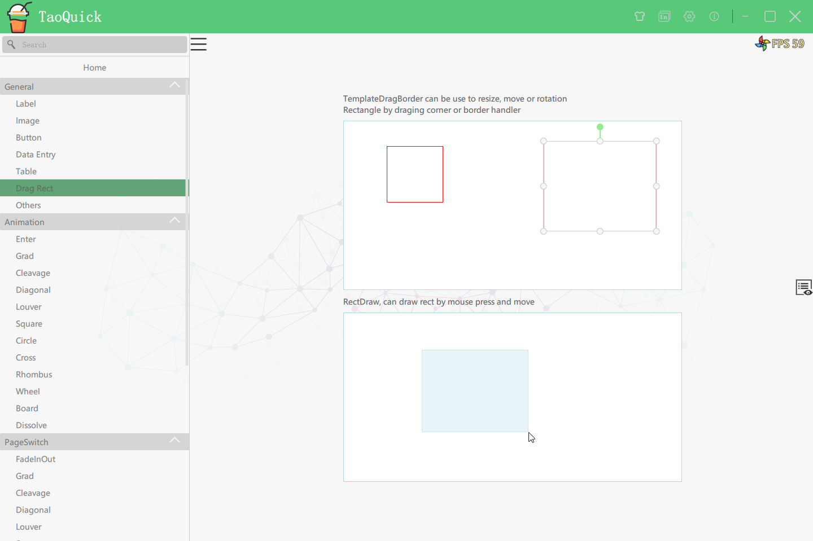

## Wizard

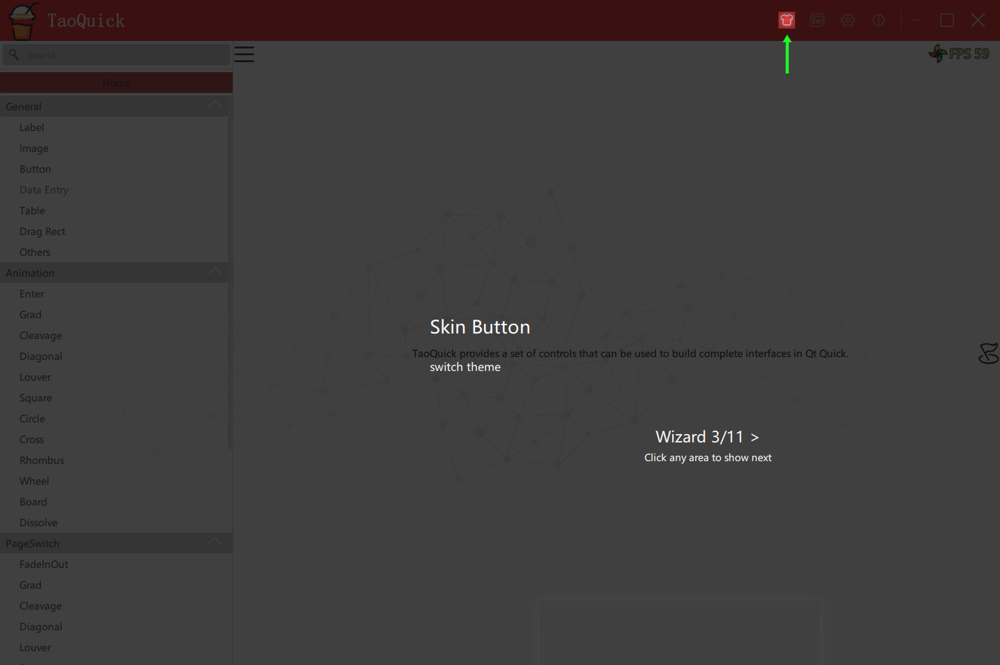
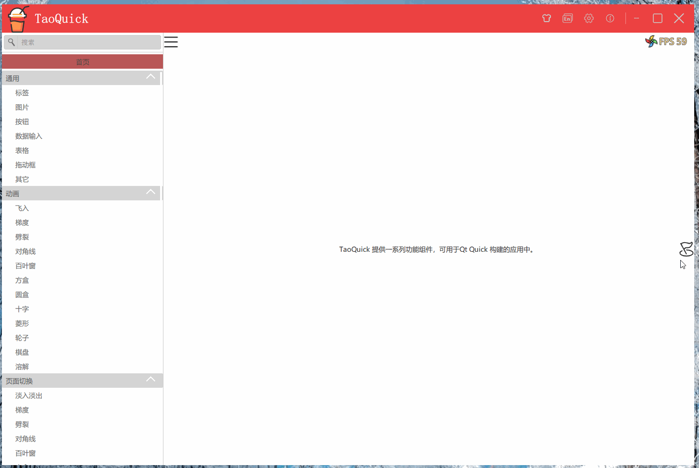

## ShaderToy-Snail

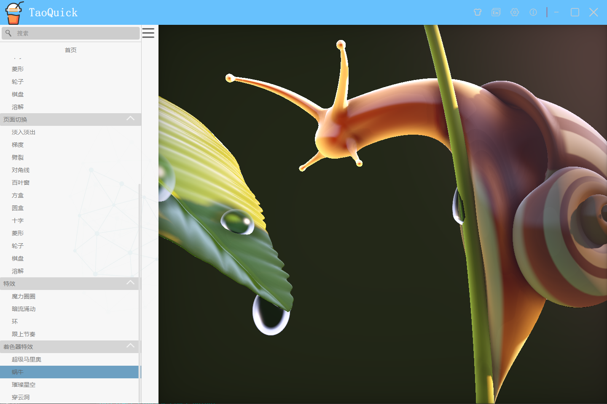

## ShaderToy-SuperMario

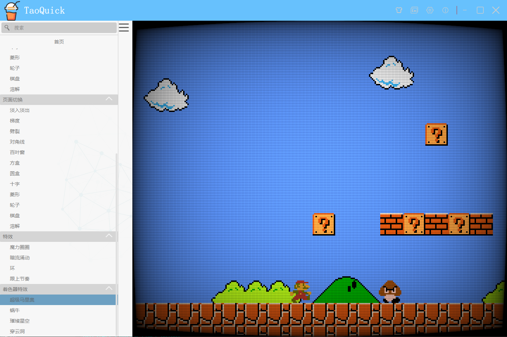

